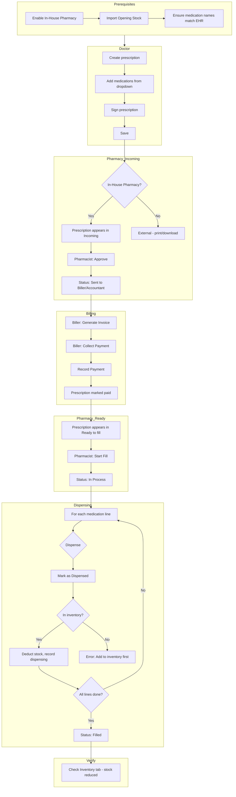

# Pharmacy Inventory Management – Testing Guide

This guide describes how to test the full pharmacy workflow: **Send prescription → Collect payment → Dispense medication**. Use it to verify that the inventory system works correctly.

---

## Prerequisites (Before Testing)

| Step | Action | Where |
|------|--------|-------|
| 1 | **Enable In-House Pharmacy** | Dashboard → toggle **💊 In-House Pharmacy: True** |
| 2 | **Import opening stock** | Pharmacy Dashboard → **Import Opening Stock** tab → paste CSV or upload file (use `data/pharmacy-opening-stock-ehr-format.csv` or your own) |
| 3 | **Ensure medication names match** | Prescribed medications (e.g. Amlodipine 10mg Tablet) must exist in inventory with the same name, strength, and form |
| 4 | **Have users** | Doctor, Pharmacist, Biller/Accountant (or Admin) roles |

---

## Testing Process

### Step 1: Doctor – Create and Sign Prescription

1. Log in as **Doctor**.
2. Open a patient (or create one).
3. Go to **Prescription** (or Clinical Note → Prescription section).
4. Add medications using the dropdown – **use names that match your inventory** (e.g. Amlodipine, Paracetamol, Omeprazole).
5. Enter strength, form, quantity, and directions.
6. **Sign** the prescription.
7. **Save** the prescription.

**Expected:** Prescription is saved and, if In-House Pharmacy is enabled, appears on the Pharmacy dashboard.

---

### Step 2: Pharmacist – Approve Prescription

1. Log in as **Pharmacist**.
2. From the main **Dashboard**, click **Pharmacy Dashboard** (or go to `pharmacy-dashboard.html`).
3. Open the **Incoming** tab.
4. Find the prescription you just created.
5. Click **Approve**.

**Expected:** Prescription status changes to **Sent to Biller/Accountant**. It stays in Incoming until payment is collected.

---

### Step 3: Biller/Accountant – Generate Invoice and Collect Payment

1. Log in as **Biller/Accountant** (or Admin).
2. From the main **Dashboard**, click **💰 Biller/Accountant Dashboard** (or go to `accountant-dashboard.html`).
3. Find the approved prescription.
4. Click **Generate invoice** (if no invoice yet).
5. Click **Collect payment**.
6. On the Collect Payment page:
   - Select payment method (Cash, Mobile Money, Card, etc.).
   - Enter amount and any required details.
   - Click **Record Payment**.

**Expected:** Invoice is marked paid. The prescription is now eligible for dispensing.

---

### Step 4: Pharmacist – Start Fill and Dispense

1. Log in as **Pharmacist**.
2. Open **Pharmacy Dashboard**.
3. Open the **Ready to fill** tab.
4. Find the paid prescription.
5. Click **Start Fill**.

**Expected:** Prescription moves to **In Process**.

6. For each medication line:
   - Click **Mark as Dispensed** (or **Dispense**).
   - The system deducts from inventory. If the medication is not in stock, you will see an error and can add it via **Inventory → Add Medication**.

7. When all lines are dispensed, the prescription is complete.

**Expected:** Prescription moves to **Filled**. Inventory stock is reduced for each dispensed item.

---

### Step 5: Verify Inventory

1. On the Pharmacy Dashboard, open the **Inventory** tab.
2. Check that stock levels decreased for the dispensed medications.

**Expected:** Quantities match what was dispensed.

---

## Troubleshooting

| Issue | Cause | Fix |
|-------|-------|-----|
| Prescription not in Incoming | In-House Pharmacy disabled | Dashboard → enable In-House Pharmacy |
| Prescription not in Incoming | Prescription not signed | Doctor must sign and save |
| Prescription not in Ready to fill | Payment not recorded | Biller must collect payment |
| "Medication not in inventory" when dispensing | Medication name/strength/form mismatch | Add via Inventory → Add Medication, or import with correct EHR format |
| No prices on invoice | Inventory has no selling_price_per_unit | Edit inventory item and set Unit Price |

---

## Flowchart

---

## Quick Reference: User Roles and Actions

| Role | Page | Key Actions |
|------|------|-------------|
| **Doctor** | Patient → Prescription / Clinical Note | Create, add meds, sign, save |
| **Pharmacist** | Pharmacy Dashboard → Incoming | Approve, Reject, Sent out |
| **Pharmacist** | Pharmacy Dashboard → Ready to fill | Start Fill |
| **Pharmacist** | Pharmacy Dashboard → In Process | Mark as Dispensed, Dispense |
| **Biller/Accountant** | Accountant Dashboard | Generate invoice, Collect payment |
| **Biller/Accountant** | Collect Payment page | Record payment |

---

## Data Files

- **Import template:** `data/pharmacy-inventory-import-template.csv`
- **Import guide:** `data/PHARMACY-INVENTORY-IMPORT-GUIDE.md`
- **Sample opening stock (EHR format):** `data/pharmacy-opening-stock-ehr-format.csv`
