# MediForge User Manual

**Last updated:** June 2026  
**Who this is for:** Doctors, nurses, receptionists, billers, lab staff, pharmacists, and clinic administrators.  
**Plain language:** Step-by-step help for everyday tasks—not technical setup.

**Also available as a web page with pictures:** open `user-manual.html` on your site (e.g. `https://mediforge.netlify.app/user-manual`).

**What’s new (June 2026):** Canadian registration and addresses, **Race** on patients, **ICD-10-CA** diagnosis search, **Health Canada prescription drug search**, **preventive care gaps** with proof attachments, manual medication entry, **patient self-intake**, **bulk patient import** (CSV/Excel), and **lab/imaging order search with categories and ordering notes**.

---

## Table of contents

1. [What is MediForge?](#1-what-is-mediforge)
2. [Logging in](#2-logging-in)
3. [Registering a clinic (Canada)](#3-registering-a-clinic-canada)
4. [Your dashboard](#4-your-dashboard)
5. [Patients — find a chart](#5-patients--find-a-chart)
6. [Add a patient (race, ICD-10, medications)](#6-add-a-patient-race-icd-10-medications)
7. [Patient self-intake](#7-patient-self-intake)
8. [Clinical notes (SOAP)](#8-clinical-notes-soap)
9. [Prescriptions](#9-prescriptions)
10. [Preventive care gaps](#10-preventive-care-gaps)
11. [Appointments and schedule](#11-appointments-and-schedule)
12. [Billing and payments](#12-billing-and-payments)
13. [Messages and tasks](#13-messages-and-tasks)
14. [Patient portal](#14-patient-portal)
15. [Role-specific dashboards](#15-role-specific-dashboards)
16. [In-patient care (hospitals)](#16-in-patient-care-hospitals)
17. [Working without internet](#17-working-without-internet)
18. [Reports and audit](#18-reports-and-audit)
19. [Administrator tasks](#19-administrator-tasks)
20. [Platform owner (all clinics)](#20-platform-owner-all-clinics)
21. [When something goes wrong](#21-when-something-goes-wrong)
22. [Getting more help](#22-getting-more-help)

---

## 1. What is MediForge?

MediForge is a **web-based health record and clinic management system**. You use it in a browser (Chrome, Edge, Safari, or Firefox) on a computer, tablet, or phone.

You can:

- Register and manage **patients**
- Write **clinical notes** and orders
- Book **appointments**
- Run **billing** and print receipts
- Send **messages** to colleagues
- Let patients use a **patient portal** (when enabled)
- Run **in-patient** workflows if your organization turns that on

Your clinic’s data is kept **separate** from other clinics on the system. You only see your organization’s patients unless you are a **platform administrator** (owner of the whole system).

---

## 2. Logging in

### Existing staff

1. Open your clinic’s MediForge address (your administrator will give you the link).
2. Enter your **username** (not always your email).
3. Enter your **password**.
4. Click **Login**.

You should land on the **Dashboard**.

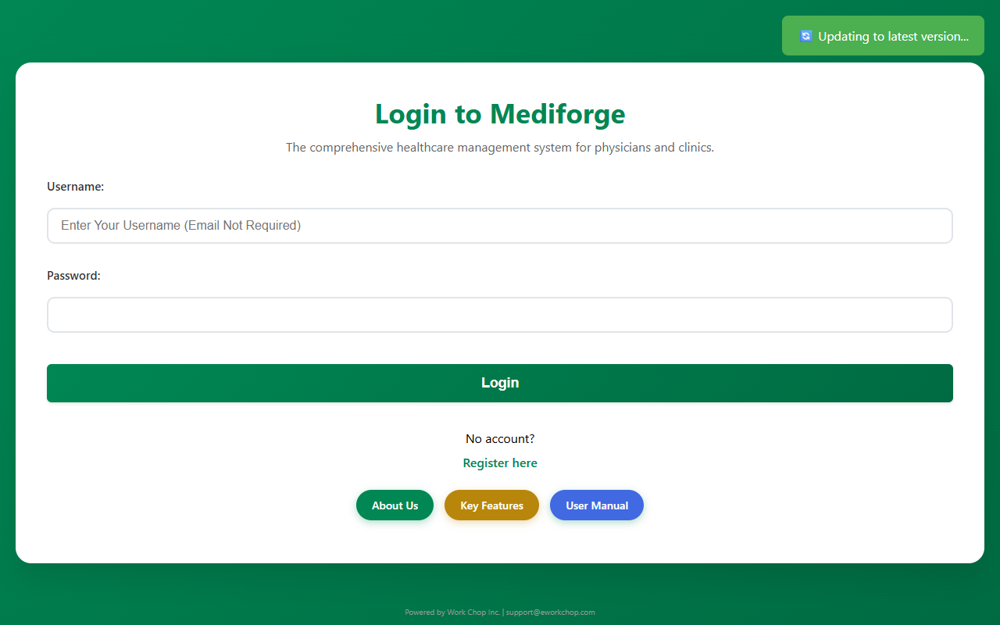

---

## 3. Registering a clinic (Canada)

### Create a new clinic

1. From the login page, click **Register**.
2. Choose **create a new organization**.
3. Enter clinic name, **Canada** address (province, city, **postal code**), and your details as first administrator.
4. Optional: provincial health card / insurance fields if your clinic uses them.
5. Accept legal agreements and submit.
6. Log in. Save your **organization code** for staff who will join.

### Join an existing clinic

1. **Register** → **join an existing organization**.
2. Enter the **organization code** from your administrator.
3. Fill in name, role, and password → submit → log in.

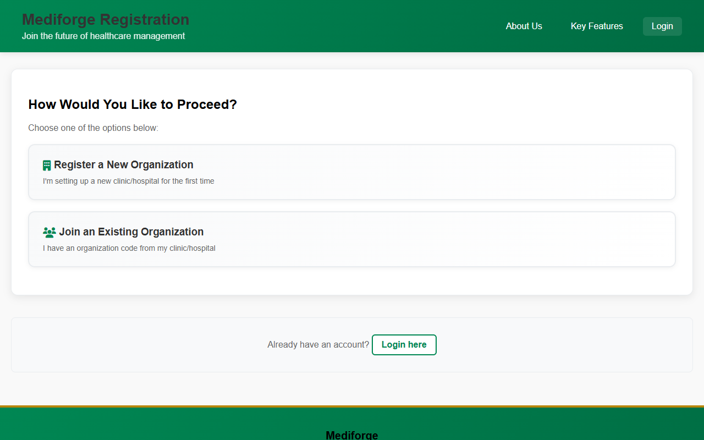

### Account locked during registration?

See [USER-INSTRUCTIONS-ACCOUNT-LOCKED.md](../USER-INSTRUCTIONS-ACCOUNT-LOCKED.md).

---

## 4. Your dashboard

After login you see the **Dashboard**—your home screen with buttons for each area.

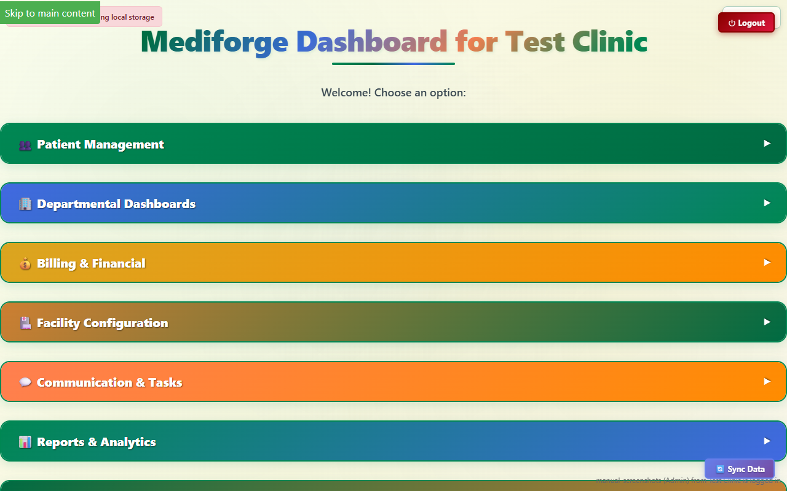

**Diagnosis codes (administrators):** Under **Facility Configuration**, click **Diagnosis Codes: ICD-10-CA / ICD-11**. Canadian clinics usually keep **ICD-10-CA** (default).

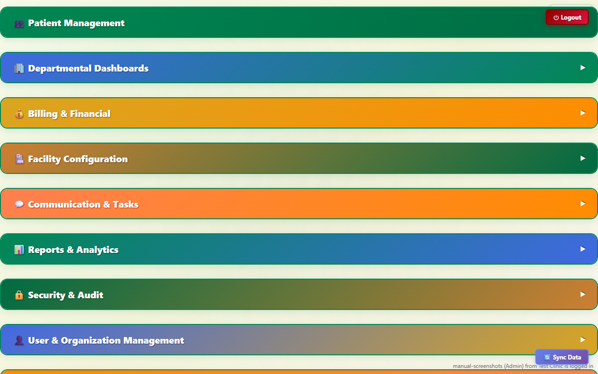

**Common buttons (your clinic may hide some by role):**

| Button | What it does |
|--------|----------------|
| **Manage Patients** | Patient list and charts |
| **Bulk Import Patients (CSV/Excel)** | Import many patients from a spreadsheet (Dashboard → Patient Management) |
| **Review Patient Intake** | Approve online patient forms |
| **Manage Appointments** | Book and edit visits |
| **Billing & Payments** | Invoices, checkout, cash register |
| **Messages** | Internal messages and tasks |
| **User Management** | Add staff (admins) |

**Tip:** If you do not see a button, your **role** may not include that permission. Ask your administrator.

---

## 5. Patients — find a chart

### Find a patient

1. Dashboard → **Manage Patients**.
2. Use **search** (name, ID, phone).
3. Click the patient row to open their chart.

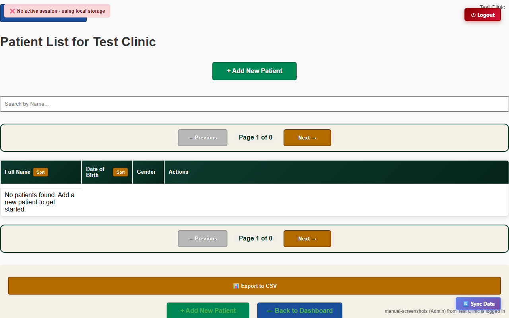

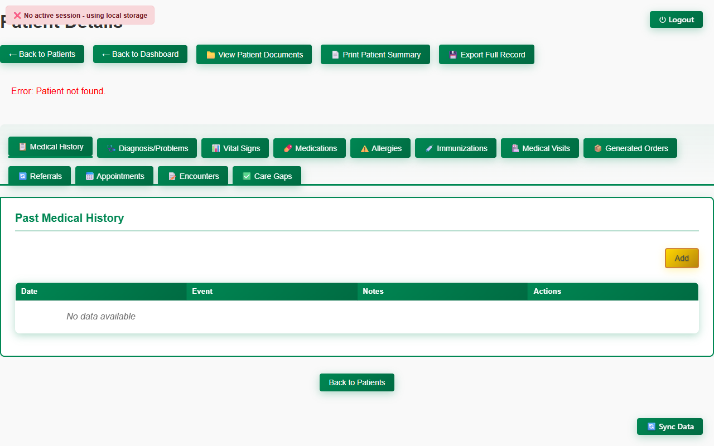

---

## 6. Add a patient (race, ICD-10, medications)

1. **Manage Patients** → **Add Patient**.
2. Enter name, date of birth, gender, phone, and **Canadian address** (province, city, **postal code**).
3. Select **Race** (required). *Declined to Disclose* is allowed.
4. Optional: PHN / insurance numbers.
5. **Past medical history — dates:** *Estimated date is acceptable* appears under date fields when the exact day is unknown.
6. **Past medical history — diagnosis search:** type a condition (e.g. *diabetes*) and pick an **ICD-10-CA** code, or use a custom entry.
7. **Medications patient already takes:** search the list, or type a name and click **Not in list? Use my typed medication name**, then enter **dosage**.
8. **Save**.

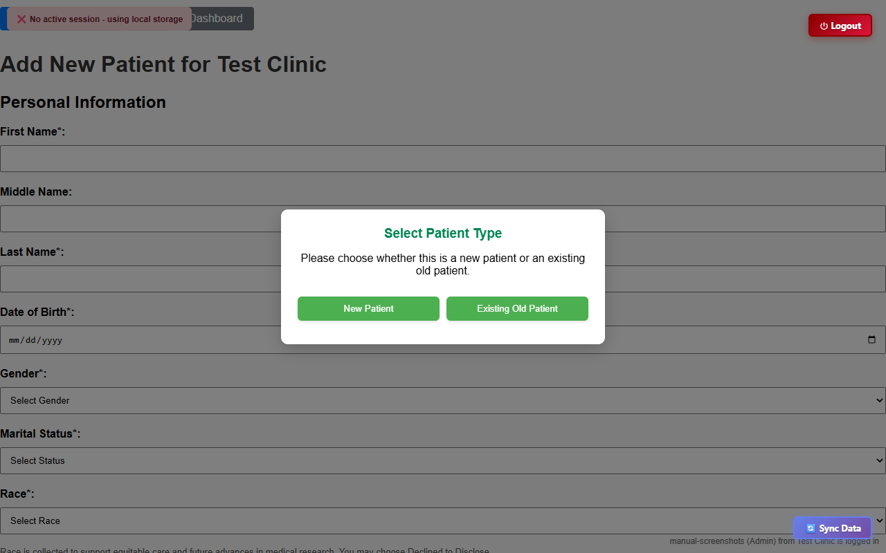

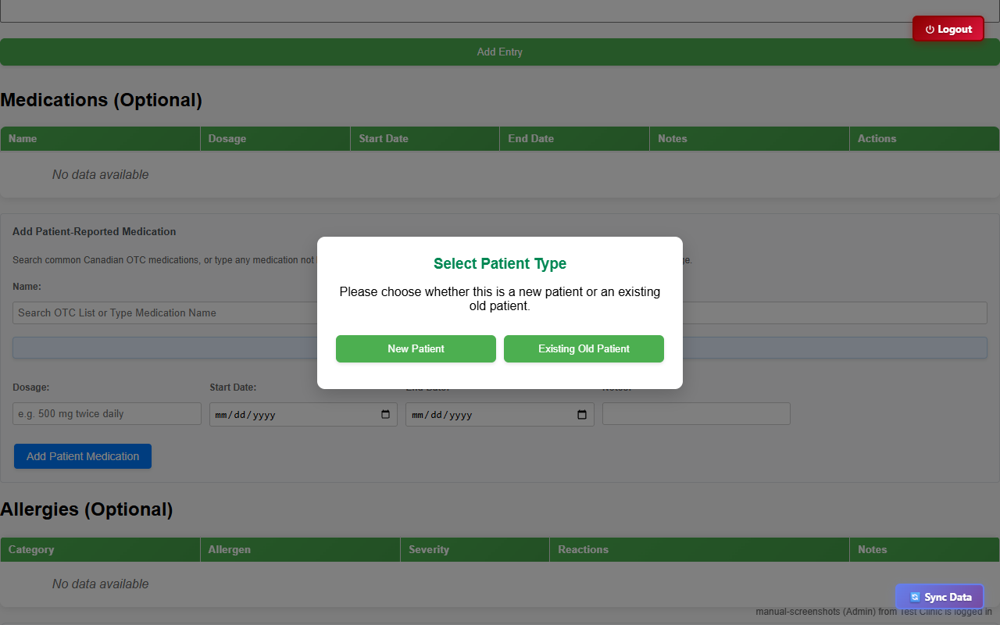

### Bulk import (many patients from Excel or CSV)

1. Dashboard → **Patient Management** → **Bulk Import Patients (CSV/Excel)**.
2. Download the template, fill patient rows in Excel, save as CSV or upload `.xlsx`.
3. Use **Patient ID** column for existing chart numbers if migrating; leave blank for auto-numbering.
4. Preview rows, then **Import patients**. Empty fields can be completed later in **Edit Patient**.

See **`docs/PATIENT-BULK-IMPORT-GUIDE.md`** for column details.

---

## 7. Patient self-intake

### Patient submits online

1. Open the intake link your clinic sent (email or SMS).
2. Fill in details, **race**, medications, and history.
3. Submit (no staff login needed).

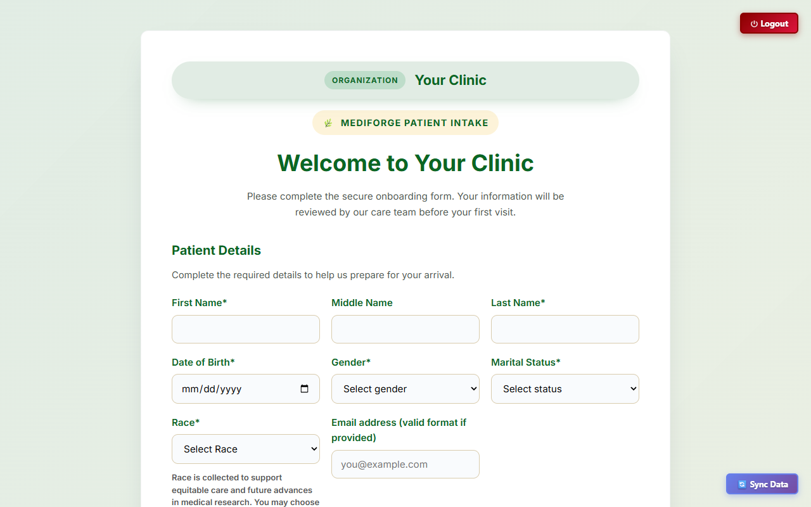

### Staff approves

1. Dashboard → **Review Patient Intake**.
2. Open a pending submission → **Approve** or reject.
3. Approved patients appear in your patient list.

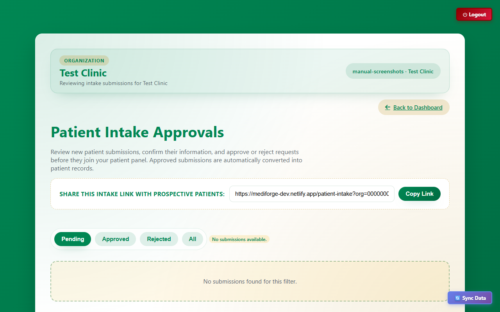

---

## 8. Clinical notes (SOAP)

A **clinical note** is where you document a visit (Subjective, Objective, Assessment, Plan).

1. Open the **patient**.
2. Open or start a **clinical note** for today’s visit.
3. Fill in the sections (history, exam, diagnosis, plan).
4. **Save** often. Notes sync to the cloud when you are online.

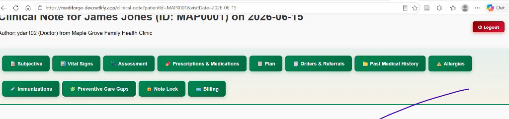

**Medical history dates:** When adding past history, immunizations, or similar items, you may see *Estimated date is acceptable.* Use your best estimate if the exact day is unknown.

**Bill a visit from the chart:** On the patient’s **Medical Visits** tab, use **Bill Visit** to create an invoice for that encounter (see [Billing](#12-billing-and-payments)).

**Admit a patient (in-patient):** If in-patient care is enabled, you may see **Admit Patient** on the clinical note.

### Lab and imaging orders

From a clinical note you can order **lab tests** or **imaging studies** (X-ray, ultrasound, CT, etc.).

1. Open the clinical note → **Order Labs** or **Order Imaging**.
2. Use the **search box** to find a test quickly, or pick a **category** (e.g. Cardiology, X-Ray, Haematology).
3. Check the tests you want. Optionally type an **ordering note** on each row (e.g. *right knee*, *fasting*, *stat*).
4. Click **Send Out** (or **Send to Lab Scientist** for in-house lab if your clinic uses it). You can also select several tests and use **bulk send** for one combined lab order.
5. Notes appear on the printed/PDF requisition with the order.

**Tip:** No database setup is required for this feature — it works after the app is updated.

---

## 9. Prescriptions

Write prescriptions with full **ICD-10-CA** diagnosis codes and **Health Canada** medication search (DIN).

1. Open a patient → **Prescription** (or use the Rx button from the chart).
2. Search **diagnosis** (type at least 2 letters, e.g. *diabetes*).
3. Add **medications**: type a drug name (e.g. *metformin*) and select from the formulary list.
4. Enter dose, route, frequency, and duration.
5. Click **Save Prescription** — diagnosis and medications update the patient chart.
6. Optional: **Send to Pharmacy** queues the Rx for your in-clinic pharmacy dashboard.
7. Print, download, or email per clinic policy.

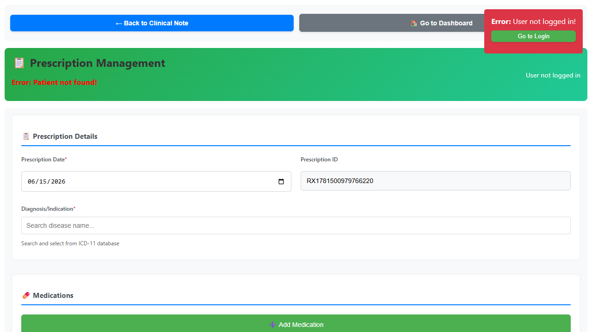

---

## 10. Preventive care gaps

MediForge lists screenings and immunizations the patient may still need (by age, sex, and chart data).

1. Clinical note → tab **Preventive Care Gaps** → **Expand Preventive Care Gaps**.
2. Red = **Unaddressed**. When done, click **Mark Addressed**.
3. Click **Add Proof** to attach a PDF or image (lab, immunization record, etc.). Proof saves to the chart.
4. **Mark Unaddressed** reverses the status. **View Proof** opens attachments.

**Tip:** Buttons are disabled while the note is **locked** — unlock first if needed.

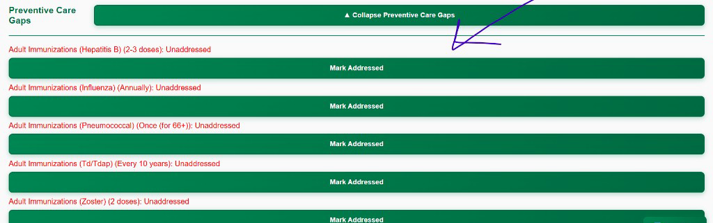

See also **Preventive Gaps Summary** on the dashboard for clinic-wide reports.

---

## 11. Appointments and schedule

### Manage appointments

1. Dashboard → **Manage Appointments**.
2. Add an appointment: pick patient, date, time, and provider if needed.
3. Edit or cancel from the same list.

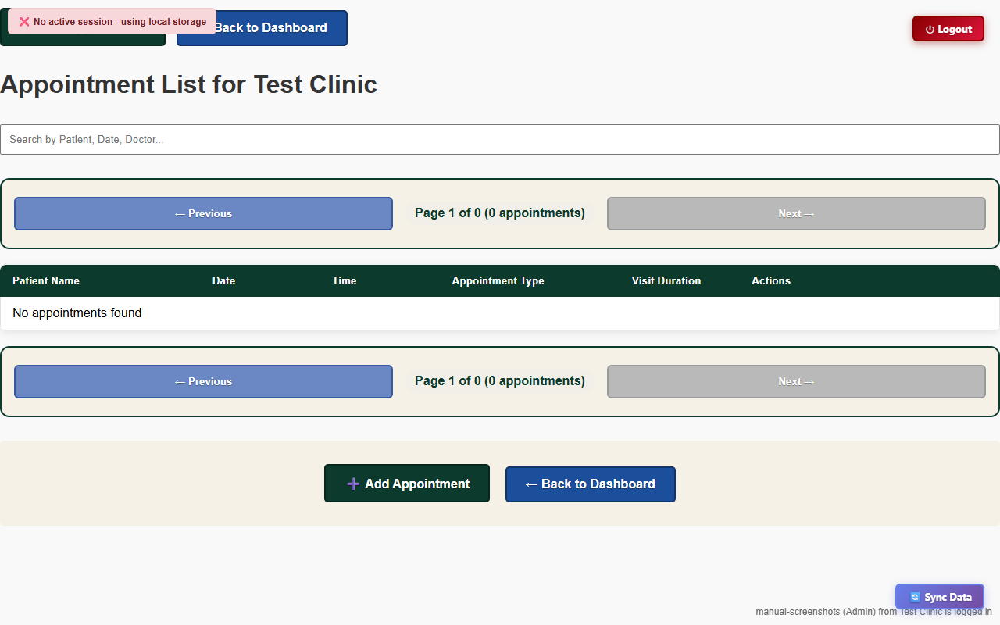

### Other scheduling tools

- **View Schedule Calendar** — calendar view  
- **Upcoming Appointments** — list of what’s next  
- **Appointment Reminder Settings** — configure reminders (admins)  
- **Upcoming Appointments – Copy SMS** — copy reminder text to send by phone  

---

## 12. Billing and payments

**Full detail:** [BILLING-SYSTEM-GUIDE.md](../BILLING-SYSTEM-GUIDE.md)

### Open billing

Dashboard → **Billing & Payments**.

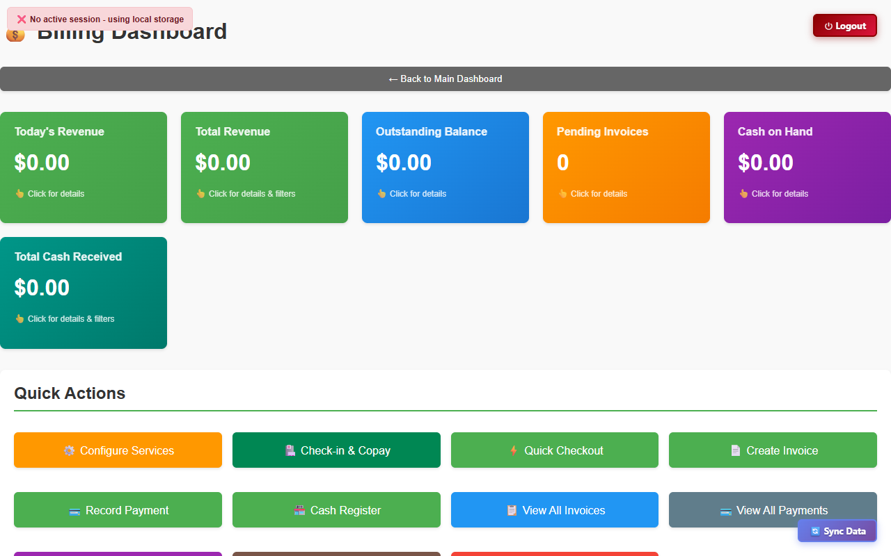

### Fastest path: Quick Checkout (walk-in paid at desk)

1. **Quick Checkout**
2. Search and select the **patient**
3. Add **services** (consultation, lab, etc.)
4. Optional: **discount**
5. Choose payment method (**Cash**, **Mobile Money**, etc.)
6. **Print receipt**

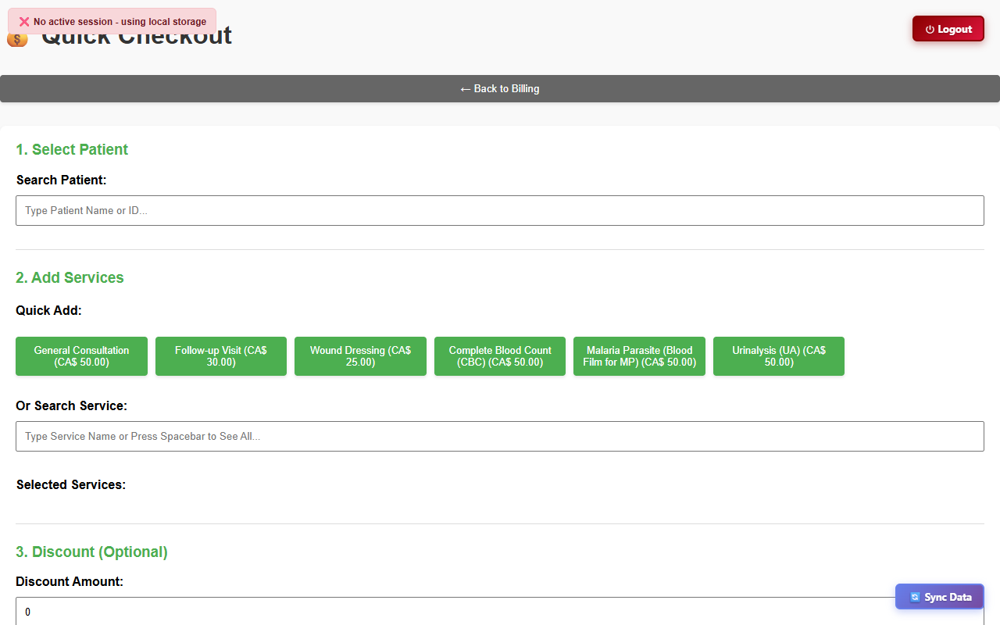

### Other billing tasks

| Task | Where to go |
|------|-------------|
| Invoice to pay later | Create invoice, then collect payment when they return |
| See all invoices | Billing → View invoices |
| Void a wrong payment | Billing → View all payments → **Void** (with reason) |
| Daily cash drawer | **Cash register** — open in morning, close at night |
| Change prices | **Pricing catalog** / Configure services |
| Month-end numbers | **Billing reports** — export CSV if needed |
| Income by department | **General Ledger** |

---

## 13. Messages and tasks

1. Dashboard → **Messages**.
2. Read messages; reply or mark done.
3. Create a new message or task for a colleague.

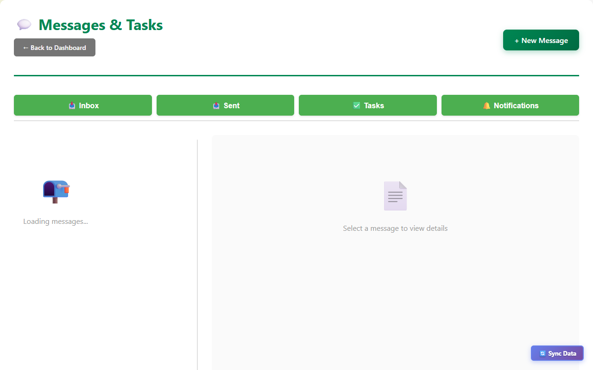

Use messages for handoffs (“please call this patient”), not for emergency care—use your clinic’s emergency procedures.

---

## 14. Patient portal

Lets patients see limited information (results, appointments, etc.) with their own login.

1. Dashboard → **Setup Patient Portal** (administrators).
2. Follow the on-screen steps to enable portal access for patients.
3. Give patients their login instructions from your clinic policy.

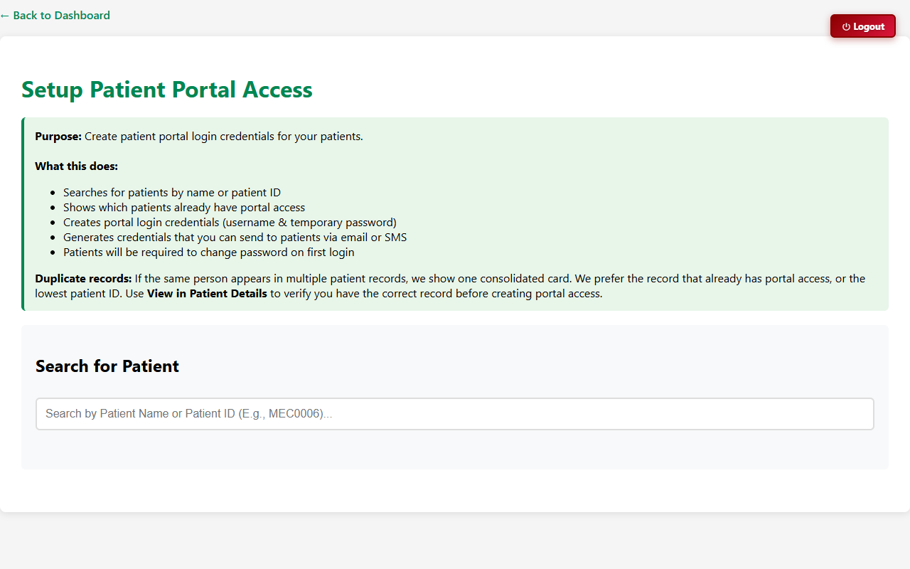

---

## 15. Role-specific dashboards

If your role includes them, the dashboard shows extra entry points:

| Role / area | Dashboard button |
|-------------|------------------|
| Pharmacy | Pharmacy Dashboard |
| Lab scientist | Lab Scientist Dashboard |
| Biller / accountant | Biller/Accountant Dashboard |
| Doctor (lab results) | Lab Results Dashboard |
| Blood pressure monitoring | Blood Pressure Alerts |
| External labs | External Lab Orders Dashboard |

Open the button that matches your job; workflows inside are similar to the main app but focused on that department.

---

## 16. In-patient care (hospitals)

**Setup guide:** [INPATIENT-SETUP-GUIDE.md](../INPATIENT-SETUP-GUIDE.md)

**Short version:**

1. Admin: Dashboard → turn **In-Patient Services** to **On**.
2. **Configure In-Patient Facilities** — add rooms and beds.
3. Doctor: admit from **clinical note**.
4. Nurse/admin: **Admissions Dashboard** — assign bed, document rounds, discharge.

---

## 17. Working without internet

MediForge can keep working when the connection drops **if you prepared while online**.

**Before you go offline:**

1. Log in while you have internet.
2. Open the pages you need (dashboard, patients, clinical note, billing).

**While offline:** You can often still view patients, save notes, and record payments. Changes save on your device and **sync when internet returns**.

**Full guide:** [HOW-TO-USE-OFFLINE-CAPABILITIES.md](../HOW-TO-USE-OFFLINE-CAPABILITIES.md) or `/how-to-use-offline-capabilities` on your site.

---

## 18. Reports and audit

- **View Reports** — clinic-level summaries  
- **Preventive Gaps Summary**, **Conditions Breakdown**, etc. — quality and population views  
- **View Audit Log** — who did what and when (admins)  
- **Security Dashboard** — security-related events (admins)  

---

## 19. Administrator tasks

### Add or manage staff

1. Dashboard → **User Management**.
2. Add user, set role, reset access as needed.

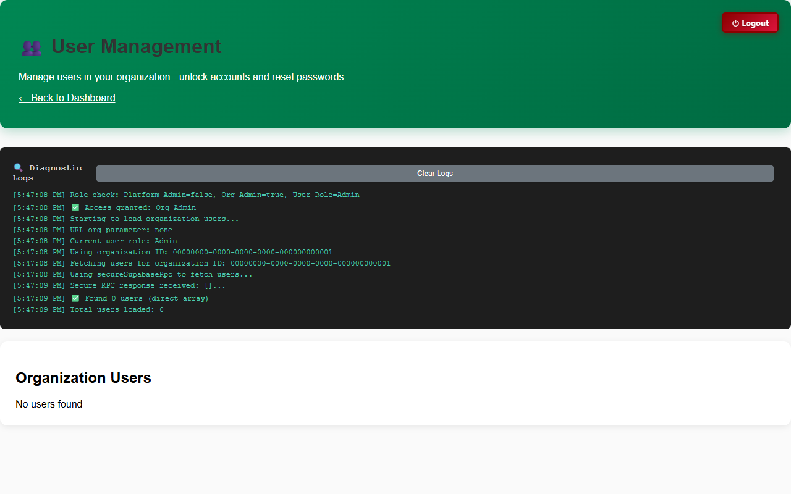

### Other admin tools

| Task | Where |
|------|--------|
| Clinic schedule | Configure Clinic Schedule |
| Subscription | Manage Subscription |
| Import/export data | Import/Export Data |
| Encryption | Setup Encryption / Recover Encryption |
| Legal agreements | Shown on dashboard when required |
| Deleted patients | View Deleted Patients |

---

## 20. Platform owner (all clinics)

**Only for the owner of MediForge**, not regular clinic staff.

- Log in at **`/platform-login`** (bookmark this URL; it is not linked from the public login page for security).
- Use **Platform Dashboard** to see all clinics, counts, and activity.
- **View** a clinic to see their dashboard; **Manage Clinics** to suspend, export, or register clinics.

**Full guide:** [PLATFORM-ADMIN-GUIDE.md](../PLATFORM-ADMIN-GUIDE.md) (credentials are not stored in the repo—use your secure password manager).

---

## 21. When something goes wrong

| Problem | What to do |
|---------|------------|
| Wrong password | Use your clinic’s password reset process or ask admin |
| Locked during registration | See [USER-INSTRUCTIONS-ACCOUNT-LOCKED.md](../USER-INSTRUCTIONS-ACCOUNT-LOCKED.md) |
| ICD search empty | Wait for codes to load; type at least 2 letters (e.g. *diabetes*) |
| Medication not in list (add patient) | Type name → **Not in list? Use my typed medication name** |
| Prescription drug not in list | Try generic name; wait for formulary; check spelling |
| Preventive gap buttons inactive | Unlock clinical note if locked; refresh page |
| Intake link broken | Ask admin to verify intake URL and database |
| Blank screen after login | Refresh; try another browser; check internet |
| Data not syncing | Go online; refresh; stay logged in |
| Billing total wrong | Check invoice line items; use **Void** only for mistaken payments |

---

## 22. Getting more help

- **This manual (web):** `user-manual.html` on your site  
- **Update manual when adding features:** [HOW-TO-UPDATE-MANUAL.md](user-manual/HOW-TO-UPDATE-MANUAL.md)
- **Screenshots:** [README-SCREENSHOTS.md](user-manual/README-SCREENSHOTS.md)
- **Billing:** [BILLING-SYSTEM-GUIDE.md](../BILLING-SYSTEM-GUIDE.md)  
- **Offline:** [HOW-TO-USE-OFFLINE-CAPABILITIES.md](../HOW-TO-USE-OFFLINE-CAPABILITIES.md)  
- **In-patient:** [INPATIENT-SETUP-GUIDE.md](../INPATIENT-SETUP-GUIDE.md)  
- **Your clinic administrator** — usernames, roles, organization code  
- **Work Chop Inc. support:** support@eworkchop.com  

---

*MediForge — clinic management for Canada and beyond. Powered by Work Chop Inc.*
