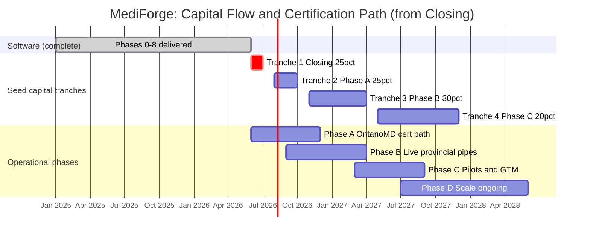

# Strategic Partner Project Plan: Costs, Timelines, and Capital Flow

**Work Chop Inc. · MediForge EMR Platform**  
**Date:** June 2026  
**Shareable web version:** https://mediforge.netlify.app/project-plan  
**Written companion to:** **`project-plan.html`** (keep in sync per `AGENT-HANDOVER.md` Rule #3)

**Related diligence:** [Financial Model](https://mediforge.netlify.app/financial-model) (interactive inputs) · [Financial Model Sources](FINANCIAL-MODEL-SOURCES.md) (evidence policy) · [Capital Deployment Detail](https://mediforge.netlify.app/capital-deployment-detail) · [Term Sheet](TERM-SHEET-SEED-PREFERRED-SHARE.md) · [Valuation & Equity Structure](VALUATION-AND-EQUITY-STRUCTURE.md) · [Revenue Projection](REVENUE-AND-NET-INCOME-PROJECTION.md) · [Ontario Readiness Report](https://mediforge.netlify.app/ontario-readiness) · [Certification path](https://mediforge.netlify.app/ontario-readiness#certification-path) · [Canada Certification Roadmap](../ROADMAP-CANADA-CERTIFICATION.md)

---

## Purpose

This document is the **single high-level overview** that ties together:

1. **Operational phases** (software Phases 0–8 complete; certification path Phases A–D forward)
2. **Seed capital deployment** (milestone-linked tranches from the Term Sheet)
3. **Phased cost bands** (what money is for, and when)
4. **Timeline** (6–12 months to commercial readiness; ~18 months for full seed deployment)

Detailed task backlogs remain in [ONTARIO-EMR-IMPLEMENTATION-PLAN.md](../ONTARIO-EMR-IMPLEMENTATION-PLAN.md). Financial terms remain authoritative in the Term Sheet and Valuation documents.

---

## Executive summary

| Dimension | Value |
|-----------|-------|
| Software delivered (Phases 0–8) | **Complete** where buildable without live credentials |
| Documented Ontario readiness | **72–82%** |
| OntarioMD certification progress | **0%** (Stages 1–5 pending) |
| Live provincial connectivity | **5–15%** (credential-gated) |
| Time to full commercial status (operational) | **6–12 months** from June 2026 |
| Seed investment (Strategic Partner) | **CAD $300,000 – $600,000** max commitment; **Base planning ~$400k** expected deploy |
| Capital deployment | **Four tranches** over **~18 months** (Tranches 3–4 conditional on milestones + approved budget) |
| Founder development fee (Company obligation) | **CAD $80,000–$120,000** (default **40%** at Closing; **25%** negotiable alternative) |
| OntarioMD milestone fees | **$27,500 + HST** (~$31,075 total; [OntarioMD](https://www.ontariomd.ca/emr-certification/emr-certification/overview)) |
| Base cert + pilot spend (benchmark) | **~$90k–$150k** new spend (excludes dev fee; see [scenarios](https://mediforge.netlify.app/financial-model#scenarios)) |

---

## Partner expectations: Lean / Base / Stress

We are seeking a seed commitment of **up to CAD $400,000** (Base default).

The term sheet **maximum commitment** is **CAD $300,000 – $600,000**.

Under **Base**, we expect to deploy approximately **CAD $300,000 – $400,000** in total.

**Sourced:** OntarioMD **$27,500 + HST** (~**$31,075**). **Benchmark (pending quotes):** new cert spend **$90k–$150k**.

The **$600,000** Stress ceiling is for diligence modeling, not our spending target.

| Scenario | Max commitment | New cert + pilot spend | Expected total deploy* |
|----------|----------------|------------------------|-------------------------|
| **Lean** | $300k | $60k–$90k | $250k–$300k |
| **Base (default)** | $400k | $90k–$150k | $300k–$400k |
| **Stress (ceiling)** | $600k | $150k–$200k+ | $450k–$600k |

*Includes dev fee and GTM buffer. Detail: [Financial Model Sources](FINANCIAL-MODEL-SOURCES.md).

---

## Gantt-style timeline (18-month horizon)

Months are indicative from **Closing (Month 0)**. Phases A and B may overlap where credentials allow.

---

## Phased costs and capital alignment

Illustrative amounts use a **$400,000 Base midpoint** (max commitment still $300k–$600k). **Benchmark cost detail:** [certification path](https://mediforge.netlify.app/ontario-readiness#certification-path) and [Financial Model Sources](FINANCIAL-MODEL-SOURCES.md). Tranche tables show sourced amounts, **TBD until quotes**, and **remaining tranche balance (awaiting quotes)** as discretionary headroom.

| Period | Operational focus | Seed tranche | Illustrative capital (CAD) | Primary cost categories |
|--------|-------------------|--------------|------------------------------|-------------------------|
| **Pre-Closing** | Phases 0–8 software (done) | n/a | Sunk founder capital; **dev fee $80k–$120k** recognized at Closing | Platform build (replacement cost **$140k–$320k+**) |
| **Month 0** | Closing; OntarioMD vendor contact; reference clinic search | **Tranche 1 (25%)** | **$75k–$150k** | Legal/PHIPA finalization (**$5k–$15k** benchmark); dev fee **$32k–$48k** at Closing (40%); consulting quotes; vendor consultation |
| **Months 2–4** | **Phase A:** certification path, Stage 1 submission, audit vendor | **Tranche 2 (25%)** | **$75k–$150k** | OntarioMD fees (**$27,500 + HST** sourced); PIA/security audit (**$10k–$40k** benchmark); evidence/consulting (**$5k–$25k+** benchmark) |
| **Months 5–10** | **Phase B:** live MCEDT/OLIS/PrescribeIT/DIR/HRM/DHDR onboarding | **Tranche 3 (30%)** | **$90k–$180k** | Provincial onboarding (mostly time); conformance testing; Stage 5 prep; dev remediation (variable) |
| **Months 11–18** | **Phase C:** pilot clinics, sales, commercial ops | **Tranche 4 (20%)** | **$60k–$120k** | Pilot/reference support (**$5k–$30k+** benchmark); marketing and sales; remaining dev fee balance if note/hybrid |
| **Ongoing** | **Phase D:** scale and expansion | Revenue / future round | TBD | Additional provinces; advanced features; compliance maintenance |

**Total seed deployment:** **$300k–$600k** over ~18 months. **Operational commercial target:** **6–12 months** (Phases A–C core path).

---

## Milestone map (capital release ↔ operations)

| Tranche | Target | Operational milestone (indicative) | Cost outcome |
|---------|--------|-------------------------------------|--------------|
| 1 | Closing | IP assigned; OntarioMD consultation initiated | Company legally funded; dev fee partial paid; audit/legal engaged |
| 2 | Months 2–4 | Reference clinic LOI; Stage 1 submitted; audit underway | Certification path unlocked; compliance spend committed |
| 3 | Months 5–10 | First provincial credential live; Stage 5 scheduled | **Conditional:** partner-approved budget + quotes |
| 4 | Months 11–18 | First pilot clinic live or first live provincial transaction | **Conditional:** partner-approved budget + quotes |

Exact release mechanics and reporting (e.g., quarterly use-of-proceeds) per definitive agreements. See [Term Sheet](TERM-SHEET-SEED-PREFERRED-SHARE.md).

---

## What is already funded (Phases 0–8)

| Phase | Delivered (software) | Status |
|-------|----------------------|--------|
| 0 | Gap report, PHIPA pack, FHIR export, readiness page | Complete |
| 1 | HL7/FHIR/DICOM, gateway audit, consent registry | Complete |
| 2 | Spec traceability, self-assessment, evidence binder | Complete |
| 3 | MCEDT claims desk, remittance, XML validation | Complete (live MOH blocked) |
| 4 | OLIS lab desk, PHN registry, HL7 export | Complete (live OLIS blocked) |
| 5 | PrescribeIT eRx queue, MedicationRequest workflow | Complete (live Infoway blocked) |
| 6 | Imaging desk, DICOMweb, launch stubs | Complete (live DIR blocked) |
| 7 | HRM inbox, File to chart, DHDR hooks, hub settings | Complete (live pipes blocked) |
| 8 | Runbook, load tests, monitoring, user manual | Complete |

This de-risks the Strategic Partner investment: seed capital funds **certification, live pipes, and go-to-market**, not greenfield EMR build.

---

## Forward operational phases (A–D)

| Phase | Timeline | Focus | Key spend |
|-------|----------|-------|-----------|
| **A** | 2–6 months | OntarioMD vendor path, Stages 1–5 prep, reference site | OntarioMD fees, audit, legal |
| **B** | 3–6 months (may parallel A) | Live OLIS, MCEDT, PrescribeIT, DIR, HRM, DHDR | Integration onboarding, testing |
| **C** | 3–6 months | 1–3 pilot clinics, support, sales collateral | Pilot ops, marketing |
| **D** | Ongoing | Scale, additional provinces, advanced features | Growth and maintenance |

Detail: [ROADMAP-CANADA-CERTIFICATION.md](../ROADMAP-CANADA-CERTIFICATION.md) and [/ontario-readiness#certification-path](https://mediforge.netlify.app/ontario-readiness#certification-path).

---

## Risk and dependency notes

- **OntarioMD pace** and **reference clinic selection** drive Phase A duration (owner-led).
- **Live provincial pipes** require Infoway/MOH/Ontario Health credentials shared by all vendors (not unique to MediForge).
- **Third-party security audit** is outstanding; benchmark **$10k–$40k** (Tranche 2); obtain vendor quote.
- **US-based dev resources:** confirm PHIPA Canada data residency before live PHI pilots.
- Tranche timing assumes good-faith milestone achievement; definitive docs define remedies if external gates delay progress.

---

*For discussion and diligence only. Not legal or financial advice. Cost benchmarks subject to vendor quotes and validation outcomes. Align with [Term Sheet](TERM-SHEET-SEED-PREFERRED-SHARE.md) and [Valuation](VALUATION-AND-EQUITY-STRUCTURE.md) for binding economics.*

### References

MediForge. (2026). *Ontario EMR readiness: Strategic partner report*. https://mediforge.netlify.app/ontario-readiness

Mindbowser. (n.d.). *OntarioMD certification: A guide for digital health vendors*. https://www.mindbowser.com/ontariomd-certification-guide-for-digital-health-vendors/

OntarioMD. (n.d.-a). *EMR certification overview*. https://www.ontariomd.ca/emr-certification/emr-certification/overview

OntarioMD. (n.d.-b). *EMR certification program FAQ*. https://www.ontariomd.ca/emr-certification/faq
